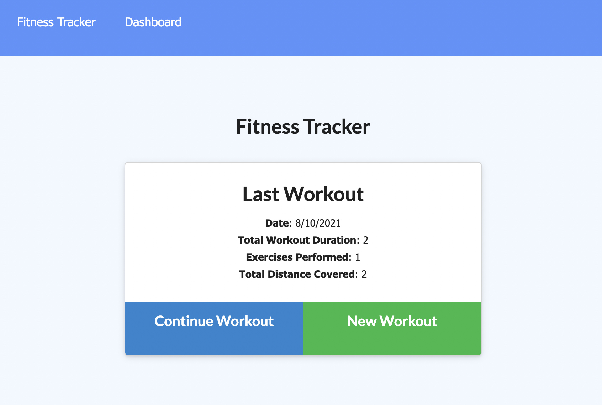

## Fitness Tracker

## Description

This fitness tracker will allow you to keep track of your cardio and weight lifting workouts by storing all your information into a Mongo Database using a Mongoose schema and Express for route handling.

## Table of Contents

- [Usage](#Usage)
- [License](#License)
- [Questions](#Questions)
- [Acknowledgements](#Acknowledgements)
- [Screenshots](#Screenshots)

## Usage

Follow these steps to use the Fitness Tracker: 1. Follow this link to the deployed application: [Fitness Tracker](https://valerie-fitness-tracker.herokuapp.com/?id=611337e4a82bac0e563dd286). 2. From the homepage select "New Workout" or "Continue Workout" and follow the prompts. 3. When you are done click `Complete` and your information will be tallied and displayed on the dashboard. 4. To view your workout totals click on "Dashboard" in the navigation bar.

## License

MIT

## Questions

For additional information please contact me via GitHub at [https://github.com/vmichalecki](https://github.com/vmichalecki) or via email at [valerie2273@gmail.com](mailto:valerie227@gmail.com?subject=[GitHub]%Fitness%Tracker).

## Acknowledgements

Miguel Alicea: [https://github.com/malicea0783](https://github.com/malicea0783)

## Screenshots

